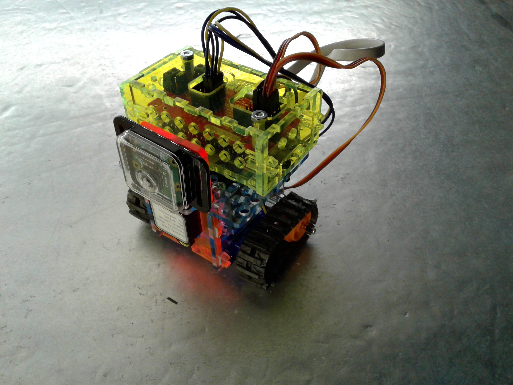
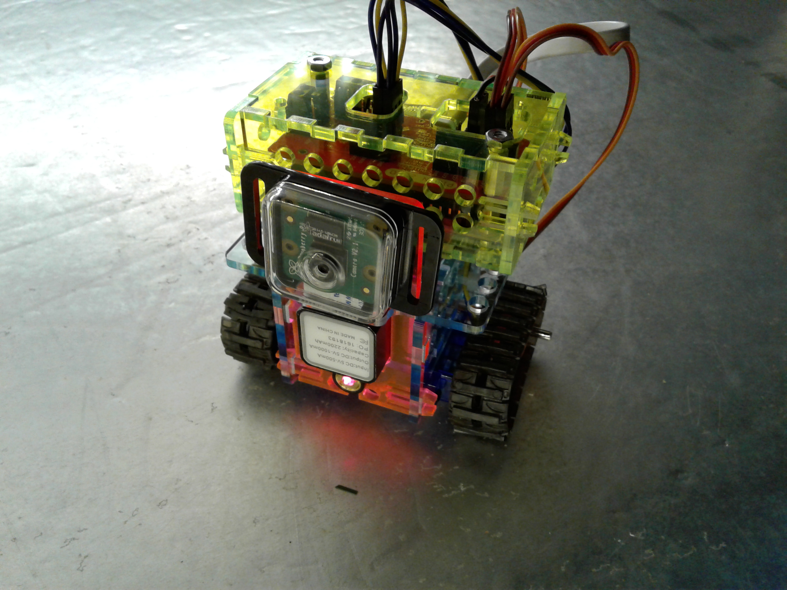
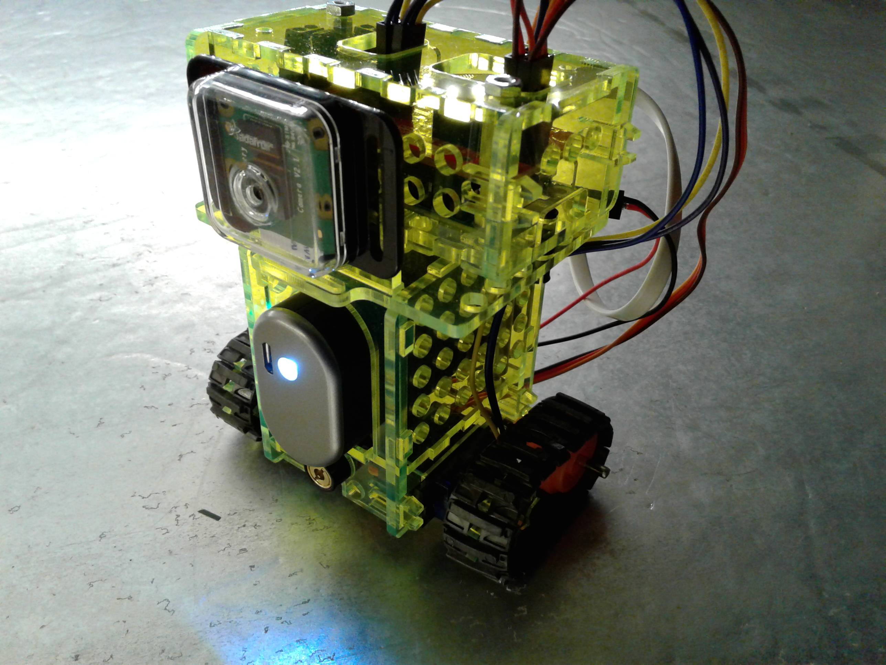
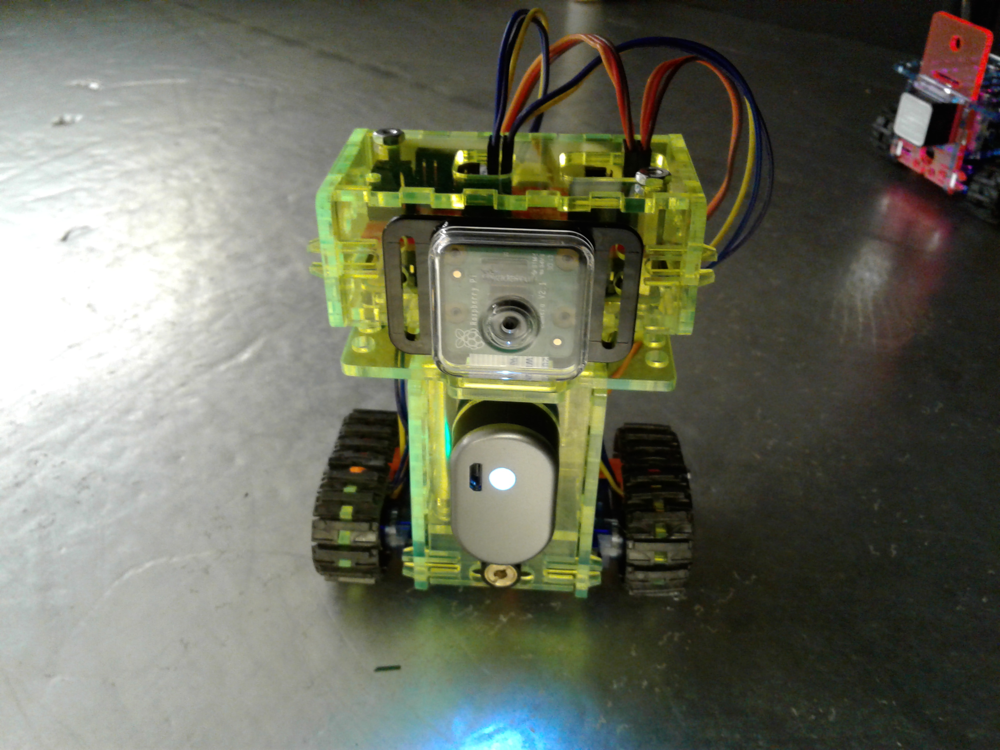
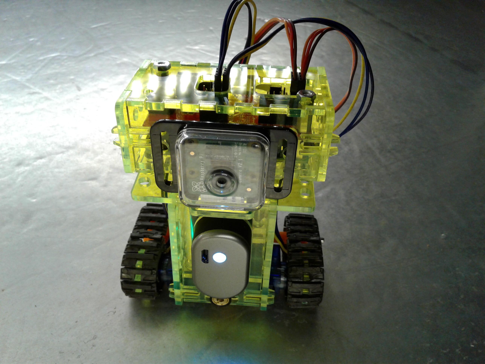
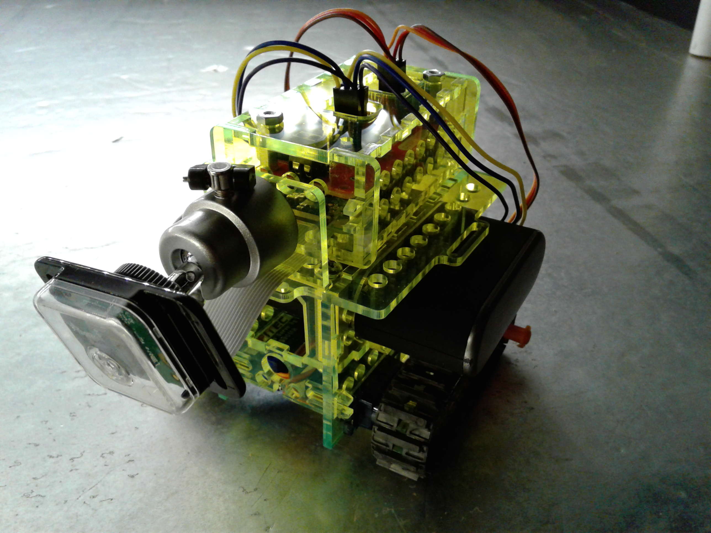
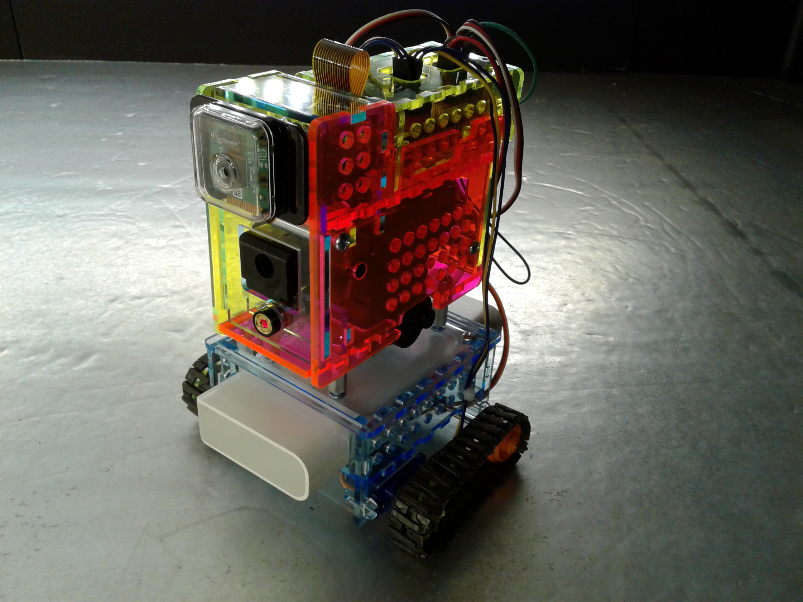
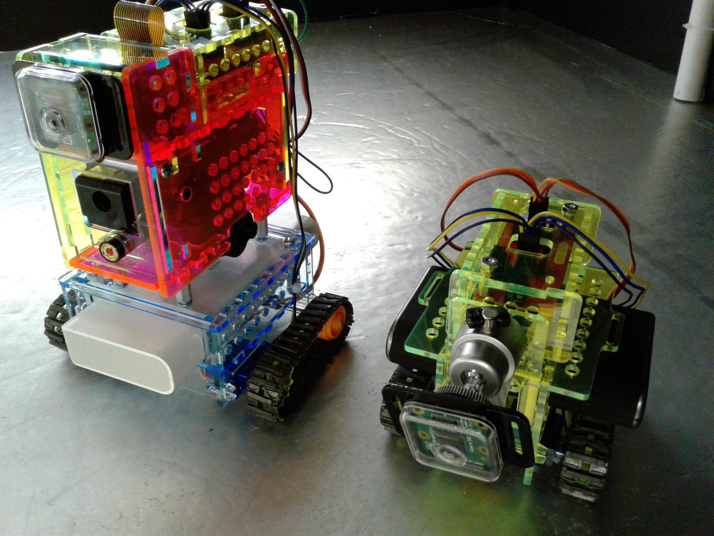

# Quasiboto Open Source Robot Platform

Quasiboto is an Open Source robotics platform compatible with the DroidGuru Web app. There are 4 versions of the Quasibot platform:

* Quasiboto Baby

* Quasiboto Jr.

* Quasiboto Papa

* Quasiboto Airsoft/Momma

## Quasibot
Quasibot can be controlled remotely with a Bluetooth connection using the [DroidGuru Android App](https://play.google.com/store/apps/details?id=ris.com.robotbuddy) in manual mode or from a web browser using the [DroidGuru Android App](https://play.google.com/store/apps/details?id=ris.com.robotbuddy) and the [DroidGuru Web App](http://droidguru.net/).

## Quasibot Tutorials on YouTube
[YouTube Tutorials & Videos](https://www.youtube.com/channel/UCOfMeLmnqhktNxsNVfA3sCg)

## Parts Files
You can make the LaserCut parts on your own using the svg parts file in the partsfile folder or order then from our [Ponoko store](https://www.ponoko.com/design-your-own/products/quasiboto-airsoft-momma-15365#).
